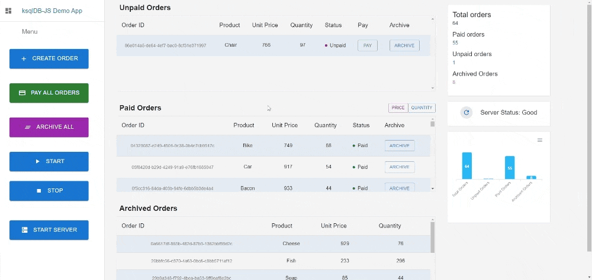
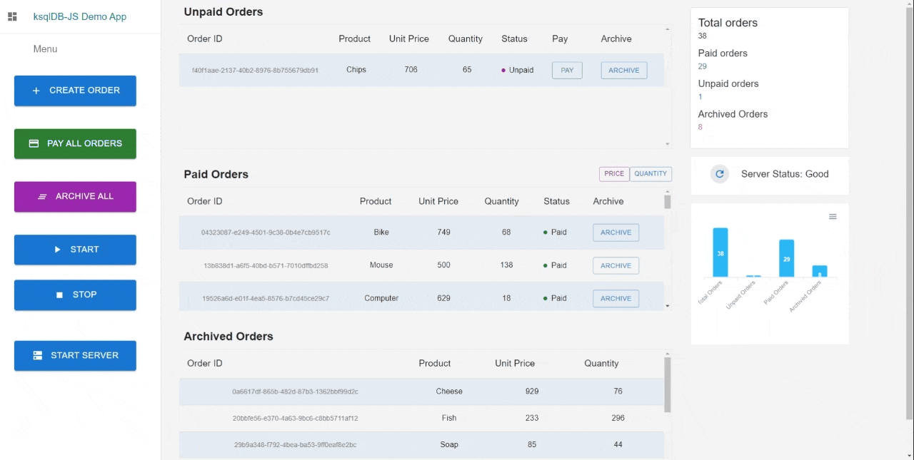

# ksQlient Ecommerce Demo App

This is a demo application to showcase the use of [ksQlient](https://github.com/oslabs-beta/ksqlSuite/tree/master/ksQlient) within a JavaScript application to process stream processing workloads in ksqlDB.

The app simulates an e-commerce website where a customer order arrives unpaid in a stream and is then pushed to a service that processes customer payment.

Once payment is verified, the order is then pushed to an archive service downstream.

The table and chart on the right shows the number of orders in real time.

# Setup

## Clone repo, cd into it:

Install all dependencies with `npm install`, then run:

```bash
npm run dev
```

# Features

- Create an order

- Pay all unpaid orders

- Archive all unpaid and paid orders

- Start and stop simulation of orders getting processed/paid and archived



- Start server - restarts application and clears all order data


